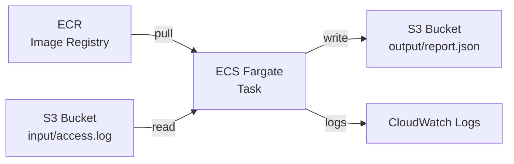

# Log-Analyse

Kleines Python-Tool zur Analyse von Webserver-Logs.
Liest eine Logdatei im Format `datum zeit methode pfad status dauer_ms` und erstellt einen JSON-Report mit Status-Verteilung, Endpoint-Statistik, stündlichem Aufkommen und den langsamsten Requests.

## Anforderungen
- Python >= 3.12
- Keine externen Abhängigkeiten zur Laufzeit

## Nutzung

```bash
python analyse.py
```

```bash
python analyse.py [path to input log] [path to output log]
```

```bash
python analyse.py -h
```

Erwartet standardmäßig ein `access.log` im selben Verzeichnis. Schreibt standardmäßig ein `report.json`. Input und Output Files können als Parameter übergeben und somit geändert werden.

## Beispiel-Input

[Beispiel](access.log)

## Beispiel-Output

[Beispiel](report.example.json)

## Deployment

Zunächst muss das Docker image gebaut werden
```bash
docker build -t log-analyse-script .
```

Anschließend kann auf dem Image das python script ausgeführt werden. Dafür muss der "host_path" zur log datei angegeben werden. Die Datei wird anschließend im Docker unter data gespeichert. Zudem wird der "log_file_name" zum zu parsenden log file und ein "report_file_name", wie der fertige report heißen soll, benötigt
```bash
docker run -v [host_path]:/data log-analyse-script /data/[log_file_name].log /data/[report_file_name].json
```

## Entwicklung

```bash
python -m venv .venv
.venv\Scripts\Activate.ps1    # Windows PowerShell
source .venv/bin/activate      # Linux / macOS
pip install -r requirements-dev.txt
ruff check .
ruff format .
```

## AWS Deployment

Das Tool kann auch als Container in AWS ECS Fargate ausgeführt werden. Die Logdatei wird aus einem S3-Bucket gelesen und der Report nach S3 zurückgeschrieben.

### Architektur



### Voraussetzungen

- AWS-Account mit konfigurierter AWS CLI (`aws configure`)
- Docker Desktop
- S3-Bucket mit der Eingabe-Logdatei

### Konfigurationsdateien

Die Dateien `task-definition.template.json` und `overrides.template.json` enthalten Platzhalter (`<AWS_ACCOUNT_ID>`, `<S3_BUCKET_NAME>`). Lokale Kopien ohne `.template` im Namen anlegen und Platzhalter durch echte Werte ersetzen — die lokalen Dateien sind via `.gitignore` ausgeschlossen.

### Setup

**1. ECR-Repository und Image push**
```bash
aws ecr create-repository --repository-name log-analyse-script --region eu-central-1
aws ecr get-login-password --region eu-central-1 | docker login --username AWS --password-stdin <AWS_ACCOUNT_ID>.dkr.ecr.eu-central-1.amazonaws.com
docker build -t log-analyse-script .
docker tag log-analyse-script:latest <AWS_ACCOUNT_ID>.dkr.ecr.eu-central-1.amazonaws.com/log-analyse-script:latest
docker push <AWS_ACCOUNT_ID>.dkr.ecr.eu-central-1.amazonaws.com/log-analyse-script:latest
```

**2. IAM-Rollen anlegen**

Zwei Rollen werden benötigt:
- `ecsTaskExecutionRole` — erlaubt ECS, das Image aus ECR zu ziehen und Logs zu schreiben
- `ecsTaskS3Role` — erlaubt dem Container, auf S3 zuzugreifen

```bash
aws iam create-role --role-name ecsTaskExecutionRole --assume-role-policy-document file://trust-policy.json
aws iam attach-role-policy --role-name ecsTaskExecutionRole --policy-arn arn:aws:iam::aws:policy/service-role/AmazonECSTaskExecutionRolePolicy

aws iam create-role --role-name ecsTaskS3Role --assume-role-policy-document file://trust-policy.json
aws iam attach-role-policy --role-name ecsTaskS3Role --policy-arn arn:aws:iam::aws:policy/AmazonS3FullAccess
```

**3. ECS Cluster und CloudWatch Log Group**
```bash
aws ecs create-cluster --cluster-name log-analyse-cluster --region eu-central-1
aws logs create-log-group --log-group-name /ecs/log-analyse-task --region eu-central-1
```

**4. Task Definition registrieren**
```bash
aws ecs register-task-definition --cli-input-json file://task-definition.json --region eu-central-1
```

**5. Task starten**

Subnet- und Security-Group-IDs aus der Default-VPC ermitteln:
```bash
aws ec2 describe-subnets --query "Subnets[0].SubnetId" --region eu-central-1
aws ec2 describe-security-groups --query "SecurityGroups[0].GroupId" --region eu-central-1
```

Task starten:
```bash
aws ecs run-task \
  --cluster log-analyse-cluster \
  --task-definition log-analyse-task \
  --launch-type FARGATE \
  --network-configuration "awsvpcConfiguration={subnets=[<SUBNET_ID>],securityGroups=[<SECURITY_GROUP_ID>],assignPublicIp=ENABLED}" \
  --overrides file://overrides.json \
  --region eu-central-1
```

### Logs prüfen

```bash
aws logs get-log-events \
  --log-group-name /ecs/log-analyse-task \
  --log-stream-name ecs/log-analyse-script/<TASK_ID> \
  --region eu-central-1
```
